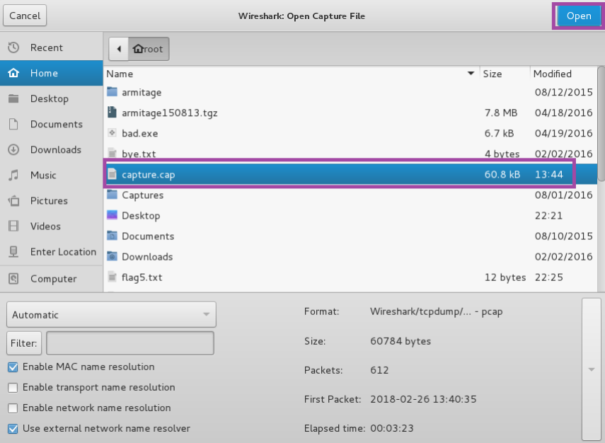

<h1>Analyzing Traffic Using Wireshark</h1>

<h2>Description</h2>
Project consists of capturing and analyzing network traffic using a sniffer.
<br />


<h2>Languages and Utilities Used</h2>

- <b>Wireshark</b>

<h2>Environments Used </h2>

- <b>Kali 2 Linux</b>

<h2>Program walk-through:</h2>

<p align="center">
View the FTP password of zombie: <br/>

<br />
<br />
View POP traffic including the password for the student account: <br/>

<br />
<br />
View the word buy from the email message you sent previously: <br/>

<br />
<br />
Right-click on the POP frame and select Follow TCP Stream: <br/>

<br />
<br />
Read the plain text traffic: <br/>

<br />
<br />
View telnet traffic: <br/>

<br />
<br />
Right-click on the first telnet frame in the list and select Follow TCP Stream: <br/>

<br />
<br />
Click Entire conversation and then click on the bottom choice in the list: <br/>

<br />
<br />
Read the command then click Close: <br/>

<br />
<br />
Click the red square to stop Wireshark: <br/>

<br />
<br />
Select file and then select open: <br/>

<br />
<br />
Click the Continue without saving button: <br/>

<br />
<br />
Click the Home link in the left hand pane: <br/>

<br />
<br />
Click the capture.cap file and then click open: <br/>

</p>

<!--
 ```diff
- text in red
+ text in green
! text in orange
# text in gray
@@ text in purple (and bold)@@
```
--!>
